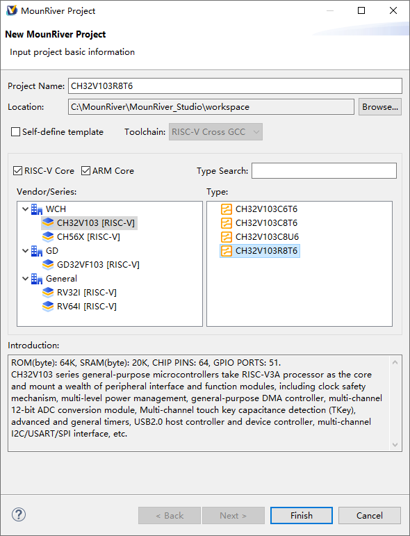
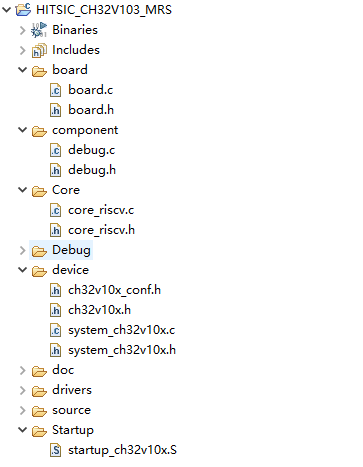
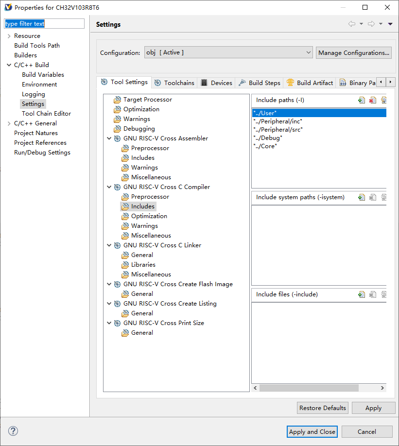

# Project Configuration - 工程配置

本节介绍如何从创建一个新的WCH-CH32V103工程，并进行初步配置。

- 简单食用：直接看“简单食用”一节，即可快速建立模板工程
- 从零开始：利用Moun_River Studio从零建立一个CH32V103工程
- 进阶技巧：一些trick

[TOC]


## 简单食用

仅需三步，即可快速建立模板工程。

- 下载工程到自己的工作空间
- 打开Moun_River Studio
- 菜单栏 `File` -> `Lode Project`，选择工程目录中 `.project`文件的路径。工程将自动导入


可供使用的工程在`cpp_support`分支下。


## 从零开始

本节利用Moun_River Studio从零建立一个CH32V103工程。

### 创建工程

- 打开Moun_River Studio

- 菜单栏 `File` -> `New` ->`MounRiver Project`，进入新建工程界面如下
  - 在默认配置上，更改以下设置
    - `Project Name` ：工程名
    - `Location` ：工作空间
    - `Vendor/Series` ：系列。选择 `WCH/CH32V103[RISC-V]`
    - Type：具体型号：根据需要选择。当前使用的是 CH32V103R8T6，我们选中它
  - 点击 `Finish`



- 工程建立后，工程目录如下：


### 整理工作目录，配置路径

推荐按照以下范式重新整理其工程结构。整理后，使用习惯贴近传统NXP工程。



- `board`：主控板的相关配置
- `component`：组件。这里仅有`debug.c/h`
- `core`：有关risc-v内核的相关设置
- `Debug`：链接文件生成位置
- `device`：ch32v103芯片的相关宏定义
- `doc`：文档
- `drivers`：ch32v103的驱动，将原工程中`Peripheral`文件夹下所有内容放在同级目录即可
- `source`：用户自己的代码存放位置
- `Startup`：ch32v103启动文件

------

整理好后，按照实际情况自行添加引用目录路径。方法与其他Eclipse工程一致。


### 重定向syscall

在source目录下添加syscall.c，用以重定向IO操作

```c++
#include "board.h"

#define RETARGET_INST   (LPUART0)

#ifdef __cplusplus
extern "C"{
#endif

#if defined (__NEWLIB__)

// ******************************************************************
// Redlib C Library function : __sys_write
// Newlib C library function : _write
//
// Function called by bottom level of printf routine within C library
// to write multiple characters.
// ******************************************************************
int _write(int iFileHandle, char *pcBuffer, int iLength)
{
    // Check that iFileHandle == 1 to confirm that read is from stdout
    if(1 == iFileHandle)
    {
        for(int i=0; i < iLength; ++i)
        {
#if (DEBUG_UART == DEBUG_UART1)
            while (USART_GetFlagStatus(USART1, USART_FLAG_TC) == RESET);
            USART_SendData(USART1, *pcBuffer++);
#elif (DEBUG_UART == DEBUG_UART2)
            while (USART_GetFlagStatus(USART2, USART_FLAG_TC) == RESET);
            USART_SendData(USART2, *pcBuffer++);
#elif (DEBUG_UART == DEBUG_UART3)
            while (USART_GetFlagStatus(USART3, USART_FLAG_TC) == RESET);
            USART_SendData(USART3, *pcBuffer++);
#endif
        }
    }

    // Function returns number of unwritten bytes if error
    return 0;
}

// ******************************************************************
// Function _read
//
// Called by bottom level of scanf routine within Newlib C library
// to read multiple characters.
// ******************************************************************
int _read(int iFileHandle, char *pcBuffer, int iLength)
{
    // Check that iFileHandle == 0 to confirm that read is from stdin
    if(0 == iFileHandle)
    {
//    if(kStatus_Success == LPUART_ReadBlocking(RETARGET_INST, pcBuffer, iLength))
//    {
//        return iLength;
//    }
//    else
//    {
//        return 0;// Count of characters read
//    }
    }
    return 0;
}

#if 0

/* Provide prototypes for most of the _<systemcall> names that are
 provided in newlib for some compilers.  */
int _close(int file)
{

}

int _lseek(int file, int ptr, int dir)
{
    return 0;
}
int _open(const char *name, int flags, int mode)
{
    return -1;
}

void _exit(void)
{
    while (1);
}

void _kill(void)
{

}

void _fstat(void)
{

}

#endif

#endif // ! __NEWLIB__


#ifdef __cplusplus
}
#endif
```

- 移动UART宏定义：将以下宏定义由`debug.h`移动至`board.h`中

```c++
/* UART Printf Definition */
#define DEBUG_UART1    1
#define DEBUG_UART2    2
#define DEBUG_UART3    3

/* DEBUG UATR Definition */
#define DEBUG   DEBUG_UART1
//#define DEBUG   DEBUG_UART2
//#define DEBUG   DEBUG_UART3

```


- 移动UART写函数：移动`debug.c/h`中的函数`void USART_Printf_Init(uint32_t baudrate)`，`int _write(int fd, char *buf, int size)`至`board.c/h`中

## 进阶技巧

本节介绍一些trick。

### 开启C++支持

由于未知原因，MounRiver Studio创建的工程竟然没有默认C++支持。



为了使用C++相关功能，必须手动修改eclipse相关配置文件。这一部分通过对比标准eclipse C++嵌入式工程的`.cproject`和MounRiver工程的`.cproject`获得。


这一部分仍待进一步更新。

> 具体步骤为：
>
> - ~~将标准eclipse C++嵌入式工程的`.cproject`中存在，但是MounRiver工程的`.cproject`没有的语句复制进去。~~

